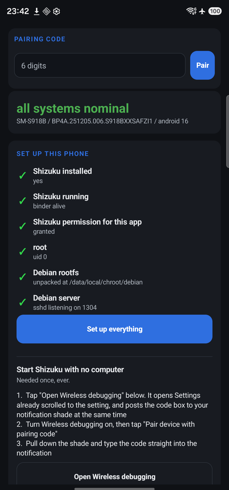
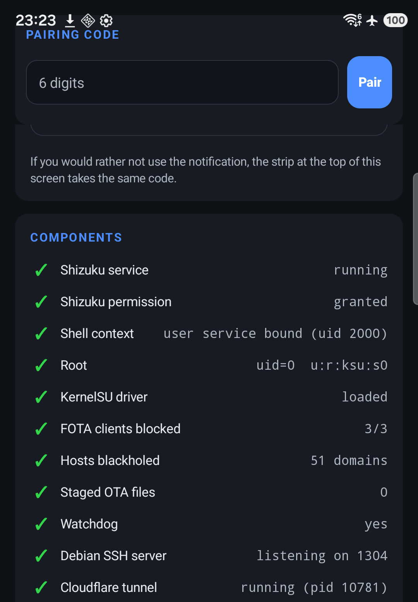

# Debian on a Samsung Galaxy S23 Ultra

Turn a stock Galaxy S23 Ultra into a small always-on Debian 13 server you can SSH
into. Root is restored automatically after every reboot, and after the initial setup
no computer is involved.

**[Download `AutoRoot.apk`](https://github.com/tingao/debian-on-s23-ultra/releases/latest/download/AutoRoot.apk)**
(14 MB) and follow [Install](#install) below.



## What it does

The bootloader is locked, so root cannot survive a reboot the usual way. Instead the
app waits for Shizuku, obtains a shell context, runs a kernel exploit, late-loads
KernelSU Next into RAM, then starts a Debian chroot that serves SSH on port 1304. The
whole sequence takes about 90 seconds and needs no input.

One APK carries everything: the exploit payloads, Shizuku, an adb client built for
Android, the device scripts and the chroot bootstrap. It downloads the Debian rootfs
at runtime because that part is 86 MB.

**It only works on this model and firmware**, because the exploit is tied to one
kernel build:

```
Samsung Galaxy S23 Ultra    SM-S918B, codename dm3q, Snapdragon 8 Gen 2
Android 16, One UI 8.5      BP4A.251205.006.S918BXXSAFZI1
kernel                      5.15.189-android13-8-33413713
```

## Install

You need the phone, the APK, and about ten minutes. No computer and no cable.

**1. Turn on Developer options.**
Settings → About phone → Software information → tap **Build number** seven times.
It will ask for your PIN and then say "Developer mode has been turned on".

**2. Turn on USB debugging.**
Settings → Developer options → **USB debugging** → on.
The app needs it, and it must stay on.

**3. Turn on Wireless debugging.**
Still in Developer options → **Wireless debugging** → on. Leave this on for now; the
app needs it once, and tells you when you can turn it off.

**4. Install the APK.**
Download `AutoRoot.apk` and open it. Android will ask you to allow installing from
this source — accept. If it warns about an unknown app, that is expected: the APK is
not from the Play Store.

**5. Open AutoRoot.**
It shows a **Set up this phone** checklist and a **Pairing code** strip at the top.
On a fresh phone the checklist items are red or amber, because nothing is done yet.

**6. Tap `Open Wireless debugging`.**
That is the button under the checklist. It does two things at once:

- opens Developer options already scrolled to the Wireless debugging entry, and
- puts a **code box into your notification shade**.

**7. Get the pairing code.**
In Developer options, tap **Pair device with pairing code**. A six-digit code appears.

**8. Type the code into the notification.**
Pull down the notification shade. There is an AutoRoot notification reading
**Enter the pairing code** with a **Reply** button. Tap Reply, type the six digits,
send. You do not need to leave the Settings screen to do this — that is the whole
point of using a notification.

**9. Tap `Set up everything`.**
Back in the app. It now does the rest itself, in order: root, the OTA lockdown,
downloading and unpacking Debian, and starting sshd. Watch the **Components** list —
each row turns green as it completes. The whole thing takes a few minutes, mostly the
download and unpack.

**10. Connect.**
When **Debian SSH server** reads *listening on 1304*, the app's **SSH access** panel
shows the exact command:

```sh
ssh -p 1304 root@<the-ip-shown-in-the-app>
```

The default root password is **`root`**. Change it immediately — see
[Before you expose this to the internet](#before-you-expose-this-to-the-internet).

### If something goes wrong

Every step writes to a console in the app and to a log file, and the app tells you the
exact command for anything it cannot do itself. [docs/15](docs/15-quickstart.md) has the
same walkthrough with the failure cases, including the by-hand route and the option of
using a computer over USB instead of wireless debugging.

### Why the app asks for a pairing code at all

Shizuku's server has to run as the *shell* user, which normally means running one `adb`
command from a computer. Android 11 and later can pair with itself over Wireless
debugging, so the app does that part for you and no computer is needed.

**The code is asked for once, ever.** Pairing is a key exchange: the app keeps its key,
the phone remembers it, and from then on Shizuku starts itself at boot with no code and
no computer. Nothing in the ordinary boot path goes near wireless debugging. If it ever
asks again, the app's data was cleared or Wireless debugging was reset on the phone.



## After a reboot

Root normally returns by itself in about 90 seconds, unattended.

The app deliberately waits **60 seconds** before touching anything, so a broken flow can
be interrupted instead of repeating on every boot. Three things stop it: the autostart
toggle in the app, a pause file, or killing the app. All three are in
[docs/13](docs/13-safety-catches.md).

If the phone was hot it takes longer, because the exploit refuses to start above 48 °C
and waits for the phone to cool.

## Before you expose this to the internet

The Debian root password starts as **`root`**, written into
`app/app/src/main/assets/00-bootstrap.sh` as `DEFAULT_PASSWORD`. It is documented on
purpose so you can get in the first time, and you are expected to change it. Until you
do, anyone who can reach port 1304 knows your root password, because it is in this
repository.

```sh
ssh -p 1304 root@<the-ip-shown-in-the-app>
passwd
```

Better: paste your own public key into `/root/.ssh/authorized_keys` and use the key.
If you would rather there were no default at all, set `DEFAULT_PASSWORD` to empty in
that file before building — bootstrap then locks the account instead of setting one, and
key authentication is the only way in.

Port 1304 listens on every interface, including the LAN. If you want to reach it from
outside your network, that is your call and your firewall: forward TCP 1304 on your
router, or put a tunnel in front of it. Either way, do the password step first.

## The parts worth knowing before you try this

**`ksu-helper --late-load` is the step that installs `su`.** The exploit can succeed and
you still have no root without it. `ksu-helper <ksud> late-load` does nothing at all,
silently, and `ku-helper` (one letter off) exits 127.

**Do not use KernelSU Next "Direct Install" on a locked bootloader.** It patches
`init_boot` in place and bricks the phone with `SECURE CHECK FAIL`. Recovery needs Odin
and stock firmware.

**The exploit will not run on a hot phone.** It is a timing attack that mutates the
running kernel, and it refuses to start above 48 °C. On this chip sustained load reaches
90 °C, so a phone that was just busy can take ten minutes to cool enough.
`gate waiting ... temp=XXC` in the log means it is working, not stuck.

**An app cannot root this phone by itself.** It has to write tracefs and
`/data/local/tmp`, and no Android app SELinux domain may do either. That is the only
reason Shizuku is involved.

**`/data` is `nosuid`, so nothing inside the chroot can escalate.** No setuid binary is
honoured, and the workaround of putting one on a suid tmpfs gets the process killed by
Android with no SELinux denial logged. That is why the login is uid 0 with no separate
privileged account.

## Why it is built this way

Most of the design is forced rather than chosen.

The bootloader is locked, so KernelSU cannot be installed into the boot image. Root is a
kernel module loaded into RAM after boot, and it dies with the RAM. That is why there is
a recovery pipeline instead of a one-time rooting step.

The kernel is built without `CONFIG_PID_NS`, `CONFIG_IPC_NS` and `CONFIG_USER_NS`, so
containers are not available. Droidspaces, LXC, Docker and the various Ubuntu-chroot
projects need PID namespaces at minimum, and none of them can be fixed without a custom
kernel, which the locked bootloader forbids. A plain `chroot` needs no namespaces and
works fine, so that is what this uses.

`/data` is mounted `nosuid`, so setuid binaries inside the chroot are ignored. That
quietly breaks `sudo` and `su` in ways that take a while to diagnose, and the workarounds
all fail. [docs/07](docs/07-dead-ends.md) has the measurements.

## Power alerts

The watchdog already runs every 60 seconds, so it also watches the battery. It sends a
message when the charger goes on or off, and when the battery gets low:

```
[System Information]
Charger disconnected.
Battery level: 100%
```

Low battery alerts once at 15%, then again on each further 5% drop. Only changes are
sent, so a phone that stays plugged in produces nothing.

It needs a Telegram bot. Either put these in the environment, or point `POWER_ALERT_CONF`
at a file containing `BOT_TOKEN=` and `CHAT_ID=`:

```
POWER_ALERT_TOKEN      bot token
POWER_ALERT_CHAT       chat or group id
```

Without them it logs that it cannot send and carries on; it never takes the watchdog
down. Because it needs no rootfs, it still works when Debian itself is not running, which
is the case that matters if the power is going away.

## Known limits

No container runtime works, because of the missing namespace support. No GPU compute is
available from the chroot, since Debian has no driver for the Adreno 740. `sudo` and `su`
cannot work inside the chroot. There is no way to cap CPU with a cgroup quota, because
the kernel is built without `CONFIG_CFS_BANDWIDTH`. All four are explained with
measurements in the docs.

## What is in here

The app source, the scripts the phone runs, and the written record of the build.

The built APK is on the
[releases page](https://github.com/tingao/debian-on-s23-ultra/releases/latest) rather than
in the tree, because it is a binary. The exploit payloads and Shizuku are bundled inside
it, both Apache-2.0 and both attributed in `NOTICE`.

| | |
|---|---|
| [docs/01](docs/01-hardware-and-constraints.md) | Hardware and the constraints that shaped everything |
| [docs/02](docs/02-root-and-reboot.md) | Root, the reboot cycle, and the thermal gate |
| [docs/03](docs/03-autoroot-app.md) | The app: Shizuku, the shell service, the boot flow |
| [docs/04](docs/04-debian-server.md) | The Debian chroot, sshd, hostnames |
| [docs/04b](docs/04b-motd.md) | MOTD, adapted from another server |
| [docs/05](docs/05-network-and-access.md) | Reaching the server, and the login account |
| [docs/06](docs/06-ota-lockdown.md) | Stopping Samsung OTA updates |
| [docs/07](docs/07-dead-ends.md) | Everything that did not work, with measurements |
| [docs/08](docs/08-gotchas.md) | Traps that cost real time |
| [docs/13](docs/13-safety-catches.md) | The delay and the brakes on the automatic flow |
| [docs/15](docs/15-quickstart.md) | **Quickstart: stock phone to running server** |

`payload/` and the app assets hold the scripts the phone actually runs. `scripts/` holds
the entry points needed to build and provision: the bootstrap, the icon generator and the
desktop connector.

This repository is the **generic build**. The author runs a private copy with his own
tunnel, keys and device notes; that material is deliberately not here, so nothing in
this tree has to be redacted before you use it.

## Credits

The exploit is [Root My Galaxy](https://github.com/soumarcelino/Root-My-Galaxy-SM-S918B)
by soumarcelino, with a community port for this firmware. Root management is
[KernelSU Next](https://github.com/rifsxd/KernelSU-Next) by rifsxd. Shell context comes
from [Shizuku](https://github.com/RikkaApps/Shizuku) by RikkaApps. The container work
tried first was [Droidspaces](https://github.com/ravindu644/Droidspaces-OSS) by
ravindu644, which is good software that this kernel simply cannot run.

## License

MIT for the original work here: the app source, the scripts and the documentation. It is
given away freely — use it, change it, ship it. The third-party components listed above
keep the licenses they came with, and `NOTICE` records each one with its copyright and
license.
